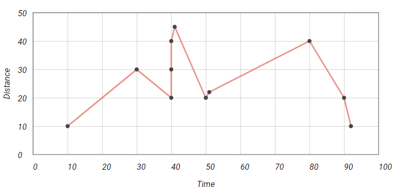
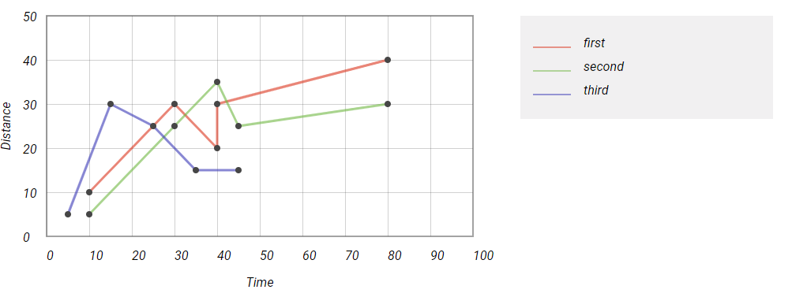
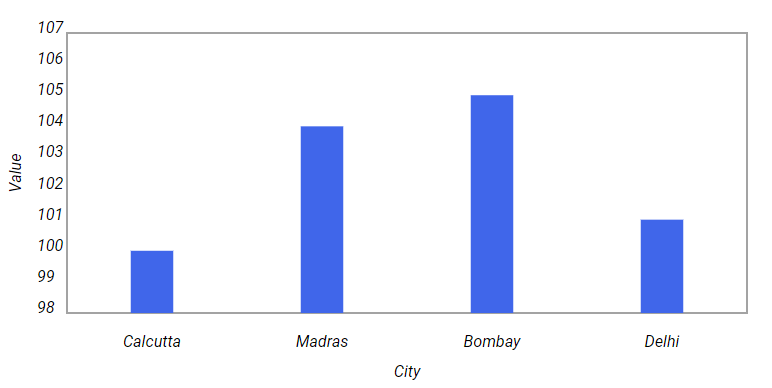
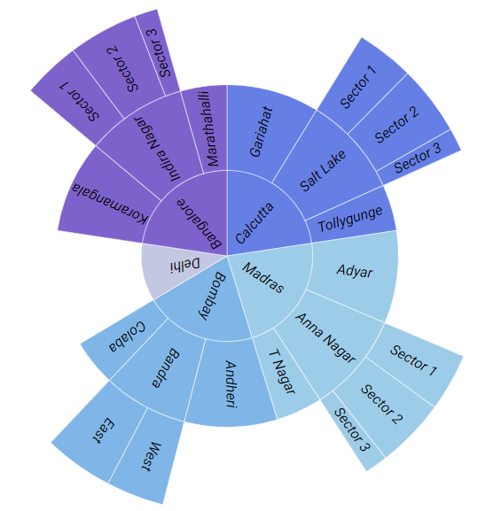

# NgxBeautifulCharts


<!--  -->
<!-- 
This library was generated with [Angular CLI](https://github.com/angular/angular-cli) version 8.0.1. -->

Started out initially as an interesting way to pass time, NgxBeautifulCharts turned out to be something that could be useful to anyone who wants to create charts in Angular. I have tried to make the charts as customizable and aesthetically pleasing as possible. More charts coming soon! :)

Check out the [wiki](https://github.com/snowPu/ngx-beautiful-charts/wiki) to know more!

## Install via NPM

> npm i ngx-beautiful-charts

## Types of charts offered
- Line Graph
- Multi Line Graph
- Bar Chart
- Clustered Bar Chart
- Pie Chart
- Donut Chart
- Sunburst Chart
- Gantt Chart

## How to use them

### Line Graph



#### TypeScript:
```
lineData = [
    {x: 10, y: 10, info: ''},
    {x: 80, y: 40, info: ''},
    {x: 30, y: 30, info: ''},
    {x: 40, y: 20, info: ''},
    {x: 40, y: 30, info: ''},
    {x: 40, y: 40, info: ''},
    {x: 50, y: 20, info: ''},
    {x: 90, y: 20, info: ''},
    {x: 41, y: 45, info: ''},
    {x: 51, y: 22, info: ''},
    {x: 92, y: 10, info: ''}
  ];
```

#### HTML:
```
<ngx-beautiful-charts [width]="800" [height]="400" 
[minX]="0" [maxX]="100" 
[minY]="0" [maxY]="50" 
[gridPrecisionX]="10" 
[gridPrecisionY]="10"
[displayXAxis]="true"
[displayYAxis]="true"
xAxisTitle="Time"
yAxisTitle="Distance"
[data]="lineData"
chartType="line-graph"
color="#ff4444"></ngx-beautiful-charts>
```

### Multi Line Graph



#### TypeScript:
```
multiLineData = [
    {name: 'first', color: '#ff1111', data: [
      {x: 10, y: 10, info: 'Point 1'},
      {x: 80, y: 40, info: 'Point 2'},
      {x: 30, y: 30, info: 'Point 3'},
      {x: 40, y: 20, info: 'Point 4'},
      {x: 40, y: 30, info: 'Point 5'}
    ]},
    {name: 'second', color: '#33bb33', data: [
      {x: 10, y: 5, info:  ''},
      {x: 80, y: 30, info: ''},
      {x: 30, y: 25, info: ''},
      {x: 40, y: 35, info: ''},
      {x: 45, y: 25, info: ''}
    ]},
    {name: 'third', color: '#3333bb', data: [
      {x: 5, y: 5, info: ''},
      {x: 15, y: 30, info: ''},
      {x: 25, y: 25, info: ''},
      {x: 35, y: 15, info: ''},
      {x: 45, y: 15, info: ''}
    ]}
  ];
```

#### HTML:
```
<ngx-beautiful-charts [width]="1100" [height]="400" 
[minX]="0" [maxX]="100" [minY]="0" [maxY]="50" 
[gridPrecisionX]="10" [gridPrecisionY]="10"
[displayXAxis]="true" [displayYAxis]="true"
xAxisTitle="Time" yAxisTitle="Distance"
[data]="multiLineData" chartType="multi-line-graph">
</ngx-beautiful-charts>
```

### Bar Chart



#### TypeScript:
```
barChartData = [
    {
      name: 'Calcutta',
      value: 1
    },
    {
      name: 'Madras',
      value: 3
    },
    {
      name: 'Bombay',
      value: 9
    },
    {
      name: 'Delhi',
      value: 8
    }
  ];
```

#### HTML:
```
<ngx-beautiful-charts [width]="800" [height]="400"
[displayXAxis]="true" colorScheme="cool"
[displayYAxis]="true"
xAxisTitle="City"
yAxisTitle="Value"
[data]="barChartData"
chartType="bar-chart" [showGridLines]="false"
color="#1166ee"></ngx-beautiful-charts>
```

### Clustered Bar Chart


#### TypeScript:
```
clusteredBarChartData = [
    {
      series: '2010',
      color: '#EAC435',
      data: [
        {
          name: 'Calcutta',
          value: 120
        },
        {
          name: 'Chennai',
          value: 300
        },
        {
          name: 'Bombay',
          value: 100
        },
        {
          name: 'Delhi',
          value: 400
        }
      ]
    },
    {
      series: '2020',
      color: '#345995',
      data: [
        {
          name: 'Calcutta',
          value: 220
        },
        {
          name: 'Chennai',
          value: 320
        },
        {
          name: 'Bombay',
          value: 130
        },
        {
          name: 'Delhi',
          value: 440
        }
      ]
    },
    {
      series: '2030',
      color: '#CA1551',
      data: [
        {
          name: 'Calcutta',
          value: 100
        },
        {
          name: 'Chennai',
          value: 100
        },
        {
          name: 'Bombay',
          value: 120
        },
        {
          name: 'Delhi',
          value: 140
        }
      ]
    }
  ];
```

#### HTML:
```
<ngx-beautiful-charts [width]="1100" [height]="400"
[displayXAxis]="true"
[displayYAxis]="true"
xAxisTitle="City"
yAxisTitle="Value"
[data]="clusteredBarChartData"
chartType="clustered-bar-chart"></ngx-beautiful-charts>
```

### Pie Chart


#### TypeScript:
```
pieChartData = [
    {
      name: 'Calcutta',
      color: '#EAC435',
      value: 50
    },
    {
      name: 'Madras',
      color: '#345995',
      value: 50
    },
    {
      name: 'Bombay',
      color: '#03CEA4',
      value: 50
    },
    {
      name: 'Delhi',
      color: '#FF6B6B',
      value: 50
    },
    {
      name: 'Bangalore',
      color: '#CA1551',
      value: 50
    }
  ];
```

#### HTML:
```
<ngx-beautiful-charts [width]="800"
[data]="pieChartData"
chartType="pie-chart"></ngx-beautiful-charts>
```

### Donut Chart


#### TypeScript:
```
donutChartData = [
    {
      name: 'Calcutta',
      color: '#EAC435',
      value: 50
    },
    {
      name: 'Madras',
      color: '#345995',
      value: 50
    },
    {
      name: 'Bombay',
      color: '#03CEA4',
      value: 50
    },
    {
      name: 'Delhi',
      color: '#FF6B6B',
      value: 50
    },
    {
      name: 'Bangalore',
      color: '#CA1551',
      value: 50
    }
  ];
```

#### HTML:
```
<ngx-beautiful-charts [width]="800"
[data]="donutChartData"
chartType="donut-chart"></ngx-beautiful-charts>
```

### Sunburst Chart



#### TypeScript:
```
sunburstChartData = [
    {
      name: 'Calcutta',
      children: [
        { name: 'Gariahat', value: 120 },
        { name: 'Salt Lake', children: [
          { name: 'Sector 1', value: 50 },
          { name: 'Sector 2', value: 60 },
          { name: 'Sector 3', value: 20 }
        ]},
        { name: 'Tollygunge', value: 60 }
      ]
    },
    {
      name: 'Madras',
      children: [
        { name: 'Adyar', value: 120 },
        { name: 'Anna Nagar', children: [
          { name: 'Sector 1', value: 50 },
          { name: 'Sector 2', value: 60 },
          { name: 'Sector 3', value: 20 }
        ]},
        { name: 'T Nagar', value: 60 }
      ]
    },
    {
      name: 'Bombay',
      children: [
        { name: 'Andheri', value: 120 },
        { name: 'Bandra', children: [
          { name: 'West', value: 50 },
          { name: 'East', value: 60 }
        ]},
        { name: 'Colaba', value: 60 }
      ]
    },
    {
      name: 'Delhi',
      value: 150
    },
    {
      name: 'Bangalore',
      children: [
        { name: 'Koramangala', value: 120 },
        { name: 'Indira Nagar', children: [
          { name: 'Sector 1', value: 50 },
          { name: 'Sector 2', value: 60 },
          { name: 'Sector 3', value: 20 }
        ]},
        { name: 'Marathahalli', value: 60 }
      ]
    }
  ];
```

#### HTML:
```
<ngx-beautiful-charts [width]="700"
[data]="sunburstChartData" colorScheme="cool"
chartType="sunburst-chart"></ngx-beautiful-charts>
```


### Gantt Chart


#### TypeScript:
```
ganttChartData = [
    {
      name: 'Market Team',
      timelines: {
        'Market Research': [
          {from: 'June 9, 2019', to: 'July 20, 2019', info: 'wtv'},
          {from: 'October 9, 2019', to: 'November 20, 2019', info: 'wtv'}
        ],
        'User Documentation': [
          {from: 'August 10, 2019', to: 'September 15, 2019', info: 'wtv'}
        ]
      }
    },
    {
      name: 'Development Team',
      timelines: {
        'Software Development': [
          {from: 'July 9, 2019', to: 'October 20, 2019', info: 'wtv'}
        ],
        'Testing': [
          {from: 'October 25, 2019', to: 'November 15, 2019', info: 'wtv'}
        ],
        'User Documentation': [
          {from: 'August 1, 2019', to: 'August 15, 2019', info: 'wtv'}
        ]
      }
    },
    {
      name: 'Test Team A',
      timelines: {
        'Testing': [
          {from: 'August 1, 2019', to: 'August 15, 2019', info: 'wtv'}
        ]
      }
    },
    {
      name: 'Test Team B',
      timelines: {
        'Testing': [
          {from: 'August 15, 2019', to: 'August 30, 2019', info: 'wtv'}
        ]
      }
    },
    {
      name: 'Sales Team',
      timelines: {
        'Pitching': [
          {from: 'July 9, 2019', to: 'October 20, 2019', info: 'wtv'}
        ],
        'Sales': [
          {from: 'October 25, 2019', to: 'November 15, 2019', info: 'wtv'}
        ]
      }
    },
    {
      name: 'Planning Team',
      timelines: {
        'Planning': [
          {from: 'May 9, 2019', to: 'May 30, 2019', info: 'wtv'}
        ]
      }
    }
  ];
```

#### HTML:
```
<ngx-beautiful-charts [width]="1100"
[data]="ganttChartData" colorScheme="cool"
chartType="gantt-chart"></ngx-beautiful-charts>
```
<!-- 
## Code scaffolding

Run `ng generate component component-name --project regular-charts` to generate a new component. You can also use `ng generate directive|pipe|service|class|guard|interface|enum|module --project regular-charts`.
> Note: Don't forget to add `--project regular-charts` or else it will be added to the default project in your `angular.json` file. 

## Build

Run `ng build regular-charts` to build the project. The build artifacts will be stored in the `dist/` directory.

## Publishing

After building your library with `ng build regular-charts`, go to the dist folder `cd dist/regular-charts` and run `npm publish`.

## Running unit tests

Run `ng test regular-charts` to execute the unit tests via [Karma](https://karma-runner.github.io).

## Further help

To get more help on the Angular CLI use `ng help` or go check out the [Angular CLI README](https://github.com/angular/angular-cli/blob/master/README.md). -->
